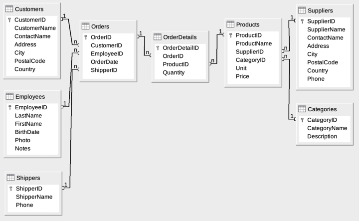

# Run dotnet project:

```
cd NorthwindTrades
dotnet run --project ./NorthwindTrades
```

# Database:

### Microsoft Northwind Trader Database

### [Wiki link](https://en.wikiversity.org/wiki/Database_Examples/Northwind)



# Backend:

### C#/.NET

# Frontend:

###

# SQL commands:

`service mysql start`  
`sudo systemctl status mysql.service`
